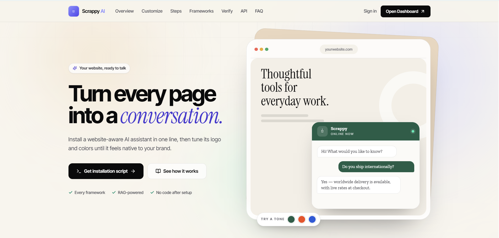

# 🤖 Scrappy AI

> **A production-ready AI chatbot SaaS platform that enables businesses to deploy intelligent, context-aware chatbots on any website using a single script tag.**

Scrappy AI is a **Retrieval-Augmented Generation (RAG)** powered chatbot platform that automatically crawls websites, extracts and indexes content, stores semantic embeddings in a vector database, and generates accurate AI responses using Large Language Models (LLMs). It provides a complete SaaS solution with customer and admin dashboards, automated website verification, and one-click chatbot integration.

---

# ✨ Features

- 🤖 AI-powered chatbot using Retrieval-Augmented Generation (RAG)
- 🌐 One-line script tag integration for any website
- 🕷️ Automated website crawling with Playwright
- 📄 Intelligent text cleaning and semantic chunking
- 🧠 NVIDIA Embedding Model integration
- 🔍 Semantic search using Qdrant Vector Database
- 💬 Context-aware AI responses using NVIDIA Nemotron LLM
- ⚡ Background indexing with BullMQ & Redis
- 👤 Customer Dashboard for website management
- 🛠️ Admin Dashboard for approval and monitoring
- 📊 Website verification before chatbot activation
- ☁️ Cloud deployment ready
- 🏢 Multi-tenant SaaS architecture

---

# 🏗️ System Architecture

```
                        Customer Dashboard
                               │
                               ▼
                     Register Website
                               │
                               ▼
                    Website Verification
                               │
                               ▼
                     Generate Script Tag
                               │
                               ▼
                  Customer Website
          <script src="widget.js" ... />
                               │
                               ▼
                     Scrappy AI Widget
                               │
                               ▼
                         Chat API
                               │
                     Retrieval Pipeline
                               │
      ┌────────────────────────┴────────────────────────┐
      │                                                 │
      ▼                                                 ▼
 Website Indexing                                User Question
      │                                                 │
      ▼                                                 ▼
 Playwright Crawl                           Generate Query Embedding
      │                                                 │
      ▼                                                 ▼
 HTML Cleaning                           Semantic Search (Qdrant)
      │                                                 │
      ▼                                                 ▼
 Intelligent Chunking                     Retrieve Relevant Context
      │                                                 │
      ▼                                                 ▼
 Embedding Generation                       NVIDIA Nemotron LLM
      │                                                 │
      ▼                                                 ▼
 Qdrant Vector Database                AI Generated Response
```

---

# 🚀 Tech Stack

## Frontend

- Next.js
- React
- TypeScript
- Tailwind CSS
- Framer Motion
- Redux Toolkit

## Backend

- Node.js
- Express.js
- MongoDB
- REST APIs
- BullMQ
- Redis
- Playwright

## AI Stack

- Retrieval-Augmented Generation (RAG)
- NVIDIA Embedding Models
- NVIDIA Nemotron LLM
- Qdrant Vector Database

## Cloud

- Vercel
- Render
- MongoDB Atlas
- Redis Cloud
- Qdrant Cloud

---

# 📂 Project Structure

```
Scrappy-AI/
│
├── frontend/
│   ├── Customer Dashboard
│   ├── Admin Dashboard
│   ├── Installation Guide
│   └── Authentication
│
├── backend/
│   ├── Controllers
│   ├── Routes
│   ├── Models
│   ├── Services
│   ├── Workers
│   ├── Queues
│   ├── Middleware
│   └── Config
│
├── widget/
│   ├── widget.js
│   └── widget.css
│
└── docs/
```

---

# ⚙️ How It Works

### 1. Register Website

Users register their website through the Scrappy Dashboard.

↓

### 2. Verify Installation

The system verifies that the generated script tag has been installed correctly.

↓

### 3. Crawl Website

Playwright crawls the website and extracts all readable content.

↓

### 4. Clean Content

HTML is cleaned, duplicates are removed, and metadata is extracted.

↓

### 5. Chunk Content

The content is split into semantic chunks for efficient retrieval.

↓

### 6. Generate Embeddings

NVIDIA Embedding Models convert each chunk into vector embeddings.

↓

### 7. Store in Qdrant

Embeddings are stored in the Qdrant Vector Database.

↓

### 8. User Chats

Visitors interact with the chatbot embedded on the website.

↓

### 9. Retrieve Context

Relevant content is retrieved using semantic similarity search.

↓

### 10. Generate Response

The retrieved context is sent to the NVIDIA Nemotron LLM, which generates an accurate, context-aware response.

---

# 💻 Widget Installation

Simply paste the generated script tag before the closing `</body>` tag of your website.

```html
<script
    src="https://your-widget-domain/widget.js"
    data-website-id="YOUR_WEBSITE_ID"
    data-api-url="https://your-api-domain.com"
></script>
```

After installation:

- Verify the website from the Scrappy Dashboard.
- Start website indexing.
- Your chatbot is ready to answer visitors.

---

# 📡 API Endpoints

### Authentication

```http
POST /api/auth/signup
POST /api/auth/login
```

### Websites

```http
POST /api/websites
GET /api/websites
POST /api/websites/:id/verify
POST /api/websites/:id/index
```

### Chat

```http
POST /api/chat
```

### Admin

```http
GET /api/admin/websites
GET /api/admin/users
PATCH /api/admin/websites/:id
```

---

# 🚀 Running Locally

Clone the repository

```bash
git clone https://github.com/yourusername/scrappy-ai.git
```

Backend

```bash
cd backend
npm install
npm run dev
```

Frontend

```bash
cd frontend
npm install
npm run dev
```

Worker

```bash
npm run worker
```

---

# ☁️ Deployment

| Service | Platform |
|----------|----------|
| Frontend | Vercel |
| Backend API | Render |
| Worker | Render |
| MongoDB | MongoDB Atlas |
| Redis | Redis Cloud |
| Vector Database | Qdrant Cloud |

---
# 🎥 Demo

<p align="center">
  <a href="https://youtu.be/vtaA-cmKJME" target="_blank">
    
  </a>
</p>

<p align="center">
  <b>▶️ Click the image above to watch the full demo</b>
</p>
# 🌟 Highlights

- Production-ready AI chatbot SaaS
- Retrieval-Augmented Generation (RAG)
- Semantic Search with Vector Database
- Multi-tenant Architecture
- Background Job Processing
- Website Verification Workflow
- Script Tag Integration
- Customer & Admin Dashboards
- Scalable Cloud Deployment
- Modern Responsive UI

---

# 🔮 Future Enhancements

- AI response streaming
- Chat analytics dashboard
- Custom chatbot themes
- Multi-language support
- Voice chatbot
- OCR support for documents
- Hybrid keyword + semantic search
- Conversation memory
- Slack, Discord & WhatsApp integrations
- Stripe subscription billing

---

# 👩‍💻 Author

**Indrani Som**

🌐 Portfolio: https://newportfolio-virid-mu.vercel.app/

💼 LinkedIn: https://www.linkedin.com/in/indrani-som-258498248

🐙 GitHub: https://github.com/IndraniSom

---

⭐ If you found this project useful, don't forget to give it a **Star**!